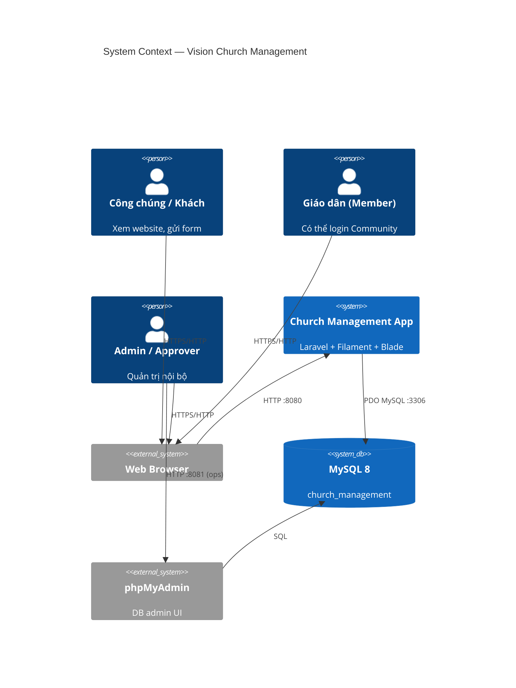
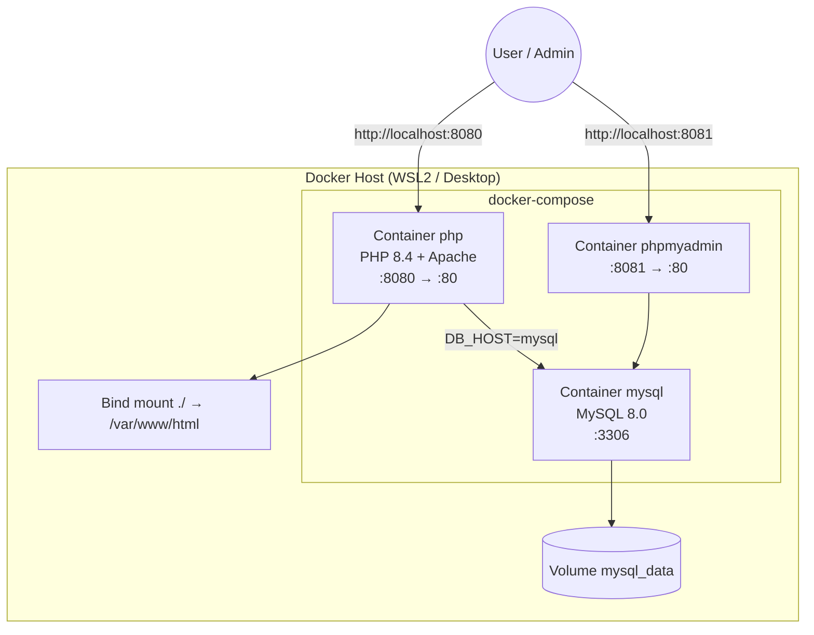
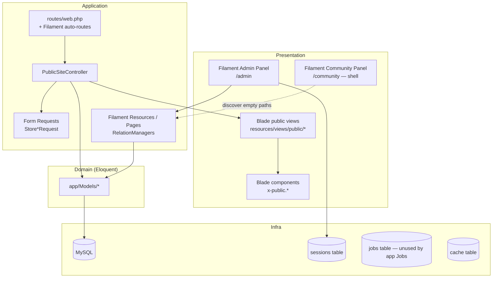
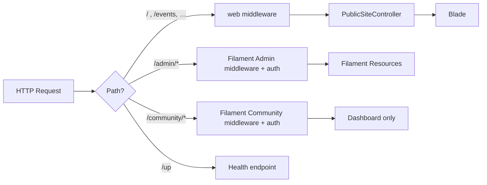
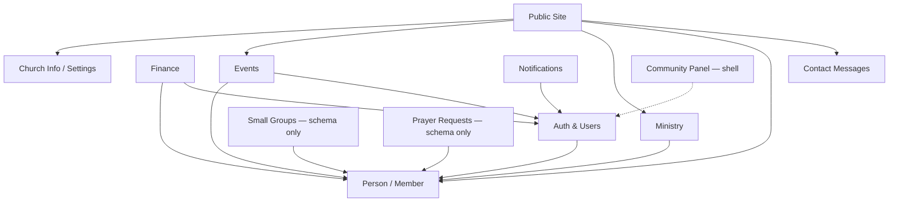
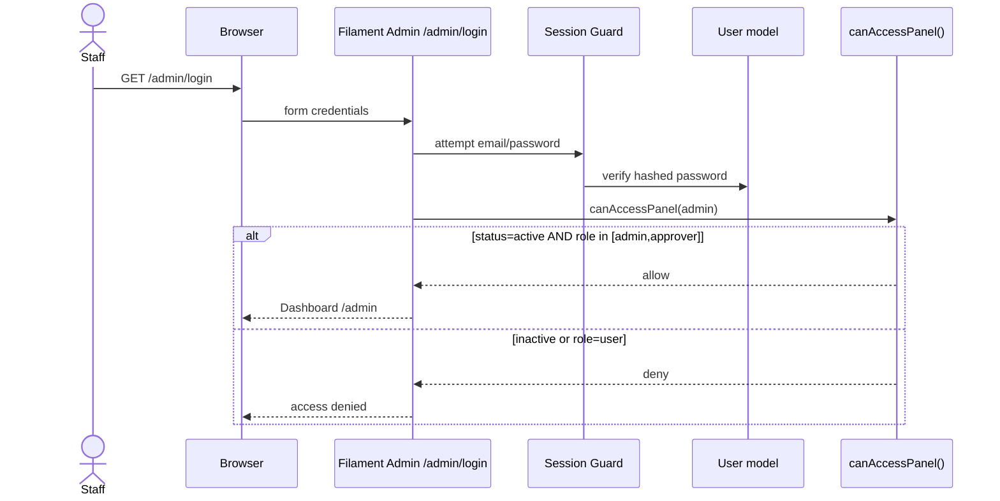
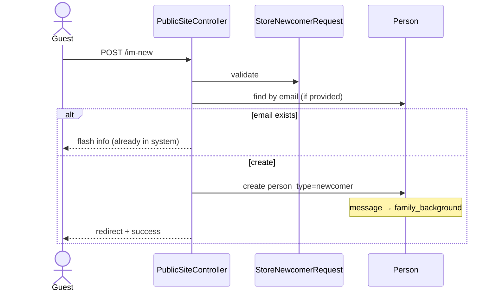
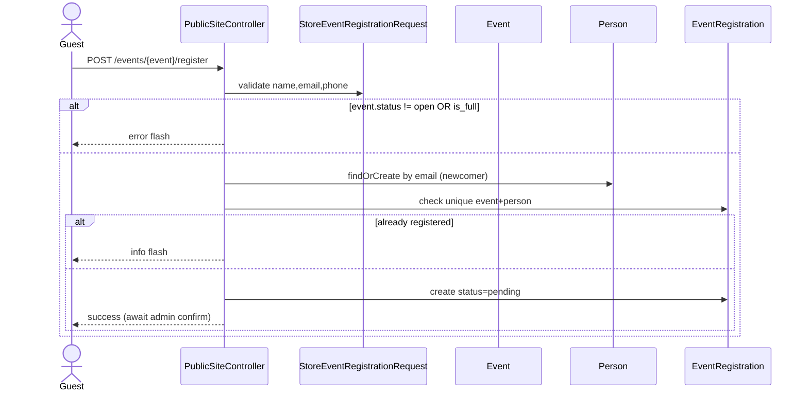
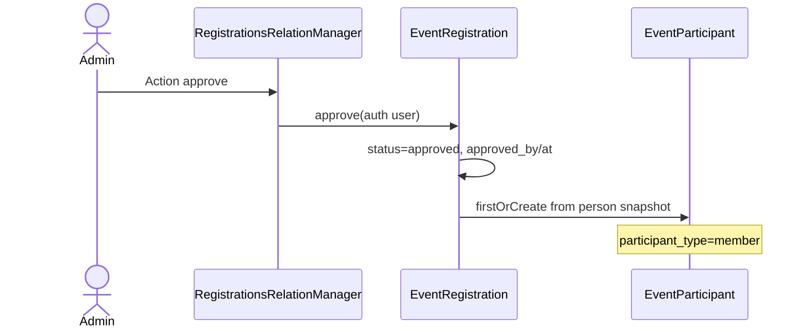
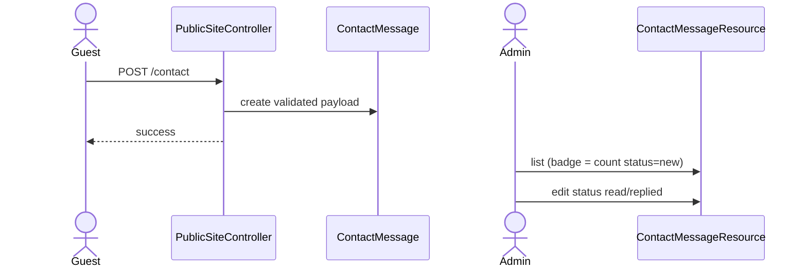

# Architecture Documentation — Vision Church Management

> Tài liệu kết hợp **SAD** (Software Architecture Document) + **SDD** (Software Design Document).  
> Nguồn sự thật: mã nguồn tại `/home/tpn_dev/Vision_church_management` (khảo sát ngày 2026-09-24).  
> Không suy diễn tính năng không tồn tại trong code.

---

## Mục lục

1. [Tổng quan dự án](#1-tổng-quan-dự-án)
2. [Tech stack & framework](#2-tech-stack--framework)
3. [Kiến trúc tổng thể (SAD)](#3-kiến-trúc-tổng-thể-sad)
4. [Module map](#4-module-map)
5. [Data architecture](#5-data-architecture)
6. [Application / Software Design (SDD)](#6-application--software-design-sdd)
7. [Sequence / flow diagrams](#7-sequence--flow-diagrams)
8. [API / Route inventory](#8-api--route-inventory)
9. [Frontend architecture](#9-frontend-architecture)
10. [Security & authorization](#10-security--authorization)
11. [Jobs / queues / scheduling](#11-jobs--queues--scheduling)
12. [Testing strategy](#12-testing-strategy)
13. [Deployment & ops](#13-deployment--ops)
14. [Gaps / technical debt](#14-gaps--technical-debt--điểm-cần-lưu-ý)

---

## 1. Tổng quan dự án

### 1.1 Mục tiêu

Ứng dụng quản lý hội thánh (church management) gồm hai bề mặt:

| Bề mặt | Mục đích | Công nghệ |
|--------|----------|-----------|
| **Public website** | Giới thiệu hội thánh, sự kiện, ban ngành; form “I’m New”, liên hệ, đăng ký sự kiện | Blade + Vite + Tailwind CSS 4 |
| **Admin panel** (`/admin`) | CRUD nội bộ: người, ban ngành, tài chính, sự kiện, thông báo, tin nhắn | Filament 3 |
| **Community panel** (`/community`) | Portal cộng đồng cho giáo dân (đã đăng ký panel, **chưa có resource**) | Filament 3 (shell) |

README mô tả: *“A church management application built with Laravel, containerized with Docker (PHP + MySQL + phpMyAdmin).”*

### 1.2 Phạm vi hiện tại (từ code)

**Đã có (Phase 1 / core):**

- Person / Newcomer / Member lifecycle
- Ministry + roles + memberships
- Finance: Category, Fund, Contributor, Transaction (approve workflow)
- Events: registration → participant → attendance
- Church info (singleton), Notifications (thông báo nội bộ / megaphone)
- Public site: Home, About, I’m New, Contact, Events, Ministries
- Contact messages từ form public

**Schema đã có nhưng chưa có UI/route đầy đủ:**

- Small Groups (`small_groups`, `small_group_memberships`)
- Prayer Requests (`prayer_requests`)

**Placeholder Phase 2 (route tồn tại, view “coming soon”):**

- `/sermons`, `/gallery` — comment trong `routes/web.php`: *“thuộc Phase 2 (chưa có domain)”*

### 1.3 Stakeholders (suy từ role & UI)

| Stakeholder | Vai trò trong hệ thống |
|-------------|------------------------|
| Khách / công chúng | Dùng public site, gửi I’m New / Contact / đăng ký event |
| Newcomer | Bản ghi `people.person_type = newcomer`, chờ approve |
| Member | `person_type = member`; có thể có `User` gắn `person_id` |
| Staff Admin (`users.role = admin`) | Full Filament Admin panel |
| Approver (`users.role = approver`) | Admin panel + approve transaction / (cùng quyền panel) |
| Community user (`users.role = user`) | Chỉ Community panel (khi active) — panel hiện trống resource |

### 1.4 Multi-tenancy

**Không có multi-tenancy.** Một instance = một hội thánh. Thông tin hội thánh lưu ở bảng `church_info` dạng **singleton** (`ChurchInfo::current()` → `firstOrCreate(['id' => 1], …)` trong `app/Models/ChurchInfo.php`).

---

## 2. Tech stack & framework

### 2.1 Runtime & backend

| Thành phần | Version (đã kiểm tra) | Ghi chú |
|------------|----------------------|---------|
| PHP | **8.4.25** (Docker `php:8.4-apache`); `composer.json` yêu cầu `^8.3` | Host WSL có thể không có PHP CLI — chạy qua Docker |
| Laravel | **13.30.1** (`laravel/framework ^13.17`) | Bootstrap style Laravel 11+: `bootstrap/app.php` |
| Filament | **3.3.55** (`filament/filament ^3.2`) | Admin + Community panels |
| Composer | 2.10.3 (trong container) | |
| Laravel Boost | **2.10.0** (dev) | AI guidelines trong `AGENTS.md` / skills |

**Packages chính (`composer show --direct`):**

- Runtime: `filament/filament`, `laravel/framework`, `laravel/tinker`
- Dev: `laravel/boost`, `laravel/pint`, `laravel/pail`, `laravel/pao`, `phpunit/phpunit`, `fakerphp/faker`, `nunomaduro/collision`, `mockery/mockery`

**Không dùng:** Inertia, Livewire standalone (Livewire đi kèm Filament), Vue/React SPA, Sanctum/Passport API, Spatie Permission, Horizon, Scout, Cashier.

### 2.2 Frontend

| Thành phần | Version | Vai trò |
|------------|---------|---------|
| Vite | ^8 | Bundler (`vite.config.js`) |
| Tailwind CSS | ^4 + `@tailwindcss/vite` | Design tokens trong `resources/css/app.css` |
| laravel-vite-plugin | ^3.1 | + Bunny fonts: **Be Vietnam Pro**, **Literata** |
| Blade | — | Public site + Filament views |
| `resources/js/app.js` | — | **File trống** (chỉ comment) |

### 2.3 Data & infra defaults (`.env` / `.env.example`)

| Concern | Giá trị điển hình |
|---------|-------------------|
| DB | MySQL 8 (`DB_HOST=mysql`, DB `church_management`) |
| Session | `database` |
| Cache | `database` |
| Queue | `database` (không có Job class tùy chỉnh) |
| Mail | `log` (dev) |
| Broadcast | `log` |

### 2.4 Deployment stack

- `Dockerfile`: `php:8.4-apache`, extensions `pdo_mysql`, `mbstring`, `gd`, `zip`, `intl`, …; DocumentRoot → `public/`
- `docker-compose.yml`: services `php` (:8080), `mysql` (:3306), `phpmyadmin` (:8081)
- Không thấy Laravel Cloud / Forge / Vapor config trong repo (skill `deploying-to-cloud` có sẵn từ Boost nhưng chưa dùng)

---

## 3. Kiến trúc tổng thể (SAD)

### 3.1 Pattern

Ứng dụng theo **Laravel MVC + Filament Resource admin**, **không có Service layer / Domain layer riêng**:

- Public: `Controller` + `FormRequest` + Eloquent + Blade
- Admin: Filament `Resource` / `Page` / `RelationManager` gọi trực tiếp Model methods (`approve`, `reject`, `publish`, …)
- Domain logic nằm trên **Eloquent models** (business methods + `booted` hooks)

### 3.2 C4 Level 1 — System context



### 3.3 C4 Level 2 — Containers / deployment



### 3.4 C4 Level 3 — Application layers / components



### 3.5 High-level request paths



---

## 4. Module map

### 4.1 Sơ đồ phụ thuộc module



### 4.2 Danh sách modules

#### M1 — Public Site

| | |
|--|--|
| **Purpose** | Website công khai Phase 1 |
| **Key files** | `app/Http/Controllers/PublicSiteController.php`, `routes/web.php`, `resources/views/public/**`, `resources/views/layouts/public.blade.php`, `resources/views/components/public/**` |
| **Depends on** | ChurchInfo, Event, Ministry, Person, ContactMessage |

#### M2 — Auth & Users

| | |
|--|--|
| **Purpose** | Đăng nhập Filament; phân quyền panel theo `role` + `status` |
| **Key files** | `app/Models/User.php`, migrations `users` / `sessions` / `password_reset_tokens`, Filament panel providers |
| **Depends on** | Person (optional `person_id`) |
| **Roles** | `admin`, `approver`, `user` |

#### M3 — Person Management

| | |
|--|--|
| **Purpose** | Hồ sơ cá nhân; Newcomer → Member approve/reject |
| **Key files** | `app/Models/Person.php`, `PersonResource`, migration `people` (+ family fields) |
| **Depends on** | — (core entity) |

#### M4 — Ministry Management

| | |
|--|--|
| **Purpose** | Ban ngành, vai trò (lookup), thành viên phục vụ |
| **Key files** | `Ministry`, `MinistryRole`, `MinistryMembership`, `MinistryResource` + `MembersRelationManager` |
| **Depends on** | Person (chỉ `members()` scope khi add) |

#### M5 — Finance Management

| | |
|--|--|
| **Purpose** | Thu/chi theo Category + Fund; Contributor; workflow pending → approved/rejected |
| **Key files** | `Category`, `Fund`, `Contributor`, `Transaction` (+ `booted` type check), Filament resources tương ứng |
| **Depends on** | User (created_by / approved_by), Person (qua Contributor) |

#### M6 — Event Management

| | |
|--|--|
| **Purpose** | Sự kiện, đăng ký public, approve → participant, điểm danh |
| **Key files** | `Event`, `EventRegistration`, `EventParticipant`, `EventAttendance`, `EventResource` + RelationManagers |
| **Depends on** | Person, User (approver) |

#### M7 — Notifications (thông báo hội thánh)

| | |
|--|--|
| **Purpose** | Draft/publish thông báo nội bộ (megaphone) — **không** phải Laravel Notification channel |
| **Key files** | `app/Models/Notification.php`, `NotificationResource` |
| **Depends on** | User (`created_by`) |
| **Ghi chú** | Public site **chưa** render danh sách notification đã publish |

#### M8 — Church Info / Settings

| | |
|--|--|
| **Purpose** | Singleton nội dung About / footer / contact |
| **Key files** | `ChurchInfo`, `Filament/Pages/ManageChurchInfo.php` |
| **Depends on** | — |

#### M9 — Contact Messages

| | |
|--|--|
| **Purpose** | Inbox tin nhắn từ form Liên hệ |
| **Key files** | `ContactMessage`, `ContactMessageResource`, `StoreContactMessageRequest` |
| **Depends on** | Public Site |

#### M10 — Small Groups (incomplete)

| | |
|--|--|
| **Purpose** | Nhóm tế bào / nhóm gia đình (khác Ministry) |
| **Key files** | Models + migration `2024_01_09_000001_*` |
| **UI/Routes** | **Không có** Filament resource / public route |

#### M11 — Prayer Requests (incomplete)

| | |
|--|--|
| **Purpose** | Lời cầu nguyện (public/private, answered) |
| **Key files** | `PrayerRequest` + migration `2024_01_09_000002_*` |
| **UI/Routes** | **Không có** |

#### M12 — Community Panel (shell)

| | |
|--|--|
| **Purpose** | Portal giáo dân tại `/community` |
| **Key files** | `CommunityPanelProvider.php` — discover `app/Filament/Community/{Resources,Pages,Widgets}` |
| **Status** | Thư mục **không tồn tại**; chỉ Dashboard + login |

#### M13 — Phase 2 placeholders

| | |
|--|--|
| **Sermons / Gallery** | Routes → `comingSoon()` view |

---

## 5. Data architecture

### 5.1 ERD — entities chính

```mermaid
erDiagram
    PEOPLE ||--o| USERS : "optional login"
    PEOPLE ||--o{ MINISTRY_MEMBERSHIPS : has
    MINISTRIES ||--o{ MINISTRY_MEMBERSHIPS : has
    MINISTRY_ROLES ||--o{ MINISTRY_MEMBERSHIPS : role
    PEOPLE ||--o| CONTRIBUTORS : "member type"
    CATEGORIES ||--o{ TRANSACTIONS : classifies
    FUNDS ||--o{ TRANSACTIONS : holds
    CONTRIBUTORS ||--o{ TRANSACTIONS : optional
    USERS ||--o{ TRANSACTIONS : created_by
    USERS ||--o{ TRANSACTIONS : approved_by
    EVENTS ||--o{ EVENT_REGISTRATIONS : has
    PEOPLE ||--o{ EVENT_REGISTRATIONS : registers
    EVENTS ||--o{ EVENT_PARTICIPANTS : has
    EVENT_REGISTRATIONS ||--o| EVENT_PARTICIPANTS : "approve creates"
    EVENT_PARTICIPANTS ||--o{ EVENT_ATTENDANCES : marks
    PEOPLE ||--o{ SMALL_GROUP_MEMBERSHIPS : joins
    SMALL_GROUPS ||--o{ SMALL_GROUP_MEMBERSHIPS : has
    PEOPLE ||--o| SMALL_GROUPS : "leader"
    PEOPLE ||--o{ PRAYER_REQUESTS : optional
    USERS ||--o{ NOTIFICATIONS : created_by
    CHURCH_INFO {
        int id PK
        string name
        date founding_date
        json contact_info
        json social_links
    }
    CONTACT_MESSAGES {
        int id PK
        string status
    }

    PEOPLE {
        int id PK
        enum person_type
        enum member_status
        soft_deletes
    }
    USERS {
        int id PK
        enum role
        enum status
    }
    TRANSACTIONS {
        enum type
        enum status
        decimal amount
    }
    EVENTS {
        enum status
        int capacity
    }
```

### 5.2 Bảng & migrations

| Migration | Tables / changes |
|-----------|------------------|
| `0001_01_01_000001_create_cache_table` | `cache`, `cache_locks` |
| `0001_01_01_000002_create_jobs_table` | `jobs`, `job_batches`, `failed_jobs` |
| `2024_01_01_000001_create_people_table` | `people` |
| `2024_01_01_000002_create_users_table` | `users`, `password_reset_tokens`, `sessions` |
| `2024_01_02_000001_create_ministry_tables` | `ministries`, `ministry_roles`, `ministry_memberships` |
| `2024_01_03_000001_create_finance_tables` | `categories`, `funds`, `contributors`, `transactions` |
| `2024_01_04_000001_create_event_tables` | `events`, `event_registrations`, `event_participants`, `event_attendances` |
| `2024_01_05_000001_create_notification_and_church_info_tables` | `notifications`, `church_info` |
| `2024_01_06_000001_add_family_info_to_people_table` | `family_background`, `marital_status` |
| `2024_01_07_000001_create_contact_messages_table` | `contact_messages` |
| `2024_01_08_000001_add_founding_date_to_church_info_table` | `founding_date` |
| `2024_01_09_000001_create_small_group_tables` | `small_groups`, `small_group_memberships` |
| `2024_01_09_000002_create_prayer_requests_table` | `prayer_requests` |

### 5.3 Enum / status đáng nhớ

| Entity | Field | Values |
|--------|-------|--------|
| Person | `person_type` | `newcomer`, `member` |
| Person | `member_status` | `active`, `inactive` (nullable) |
| User | `role` | `admin`, `approver`, `user` |
| User | `status` | `active`, `inactive` |
| Category / Transaction | `type` | `income`, `expense` |
| Transaction | `status` | `pending`, `approved`, `rejected` |
| Event | `status` | `draft`, `open`, `closed`, `completed`, `cancelled` |
| EventRegistration | `status` | `pending`, `approved`, `rejected`, `cancelled` |
| EventParticipant | `participant_type` | `member`, `external` |
| EventAttendance | `status` | `present`, `absent` |
| Notification | `status` | `draft`, `published` |
| ContactMessage | `status` | `new`, `read`, `replied` |
| Contributor | `type` | `member`, `external` |

### 5.4 Design decisions ghi trong migration comments

- Gộp Admin + User thành một bảng `users` liên kết `person_id`
- Category income/expense một bảng + cột `type` (constraint khớp type được enforce ở model `Transaction::booted`)
- Fund tách khỏi Category (“ví tiền” vs “loại phiếu”)
- Registration → Participant được nối FK khi approve
- Attendance không duplicate `event_id` (đi qua participant)
- Ministry role là lookup table, không hard-code enum DB

---

## 6. Application / Software Design (SDD)

### 6.1 Directory layout (ứng dụng)

```
app/
  Filament/
    Pages/ManageChurchInfo.php
    Resources/{Person,Ministry,Event,Category,Fund,Contributor,Transaction,Notification,ContactMessage}Resource.php
    …/Pages, RelationManagers
  Http/
    Controllers/{Controller,PublicSiteController}.php
    Requests/Store{ContactMessage,EventRegistration,Newcomer}Request.php
  Models/… (18 models)
  Providers/
    AppServiceProvider.php
    Filament/{Admin,Community}PanelProvider.php
bootstrap/app.php          # routing + middleware + exceptions
routes/{web,console}.php   # không có api.php / channels.php
database/{migrations,seeders,factories}
resources/{css,js,views}
tests/{Feature,Unit}
```

**Không tồn tại:** `app/Policies`, `Jobs`, `Events`, `Listeners`, `Notifications` (Laravel), `Services`, `Http/Middleware` tùy chỉnh, `routes/api.php`.

### 6.2 Naming & conventions

- Eloquent: singular English model names (`Person`, `Ministry`)
- Filament navigation groups: English labels (`Person Management`, `Finance Management`, …)
- UI copy: hỗn hợp EN/VI (forms tiếng Việt ở nhiều chỗ)
- Soft deletes: `Person`, `Ministry`, `Event`, `SmallGroup`
- Business actions trên model: `approveAsMember`, `approve`/`reject` (Transaction, EventRegistration), `publish`, `endService`, `markAnswered`

### 6.3 Routing design

- Public: explicit named routes trong `routes/web.php`
- Admin/Community: Filament auto-discovery
- Health: `/up` (Laravel default trong `bootstrap/app.php`)
- Không rate-limit tùy chỉnh trong code ứng dụng

### 6.4 Providers

`bootstrap/providers.php`:

1. `AppServiceProvider` — trống
2. `AdminPanelProvider` — default panel, path `admin`, brand color `#006E58`, discover `app/Filament/Resources|Pages|Widgets`
3. `CommunityPanelProvider` — path `community`, discover **riêng** `app/Filament/Community/…` (tránh đụng resource admin)

### 6.5 Seeders

`DatabaseSeeder` gọi:

1. `MinistryRoleSeeder` — Trưởng ban / Phó ban / Thành viên  
2. `CategorySeeder` — income/expense categories tiếng Việt  
3. `AdminUserSeeder` — `admin@church.local` / `password`  
4. `DemoSeeder` — church info, ~40 people, ministries, finance, events, notifications, approver/user accounts  
5. `ContactMessageSeeder`

Factory: chỉ `UserFactory` (Laravel default).

---

## 7. Sequence / flow diagrams

### 7.1 Admin login (Filament)



### 7.2 I’m New (public → Person newcomer)



### 7.3 Event registration (public)



### 7.4 Approve registration → participant



### 7.5 Transaction create & approve

```mermaid
sequenceDiagram
    actor Staff
    participant Create as CreateTransaction page
    participant Tx as Transaction
    participant Cat as Category
    actor Approver

    Staff->>Create: submit form
    Create->>Create: created_by=auth, status=pending
    Create->>Tx: save
    Tx->>Cat: assert category.type == transaction.type
    alt mismatch
        Tx-->>Create: ValidationException
    end
    Approver->>Tx: approve()/reject() via table action
    Note over Approver: visible only if isApprover()
```

### 7.6 Contact message



---

## 8. API / Route inventory

**Không có REST API** (`api.php` không tồn tại). Toàn bộ là web/Filament.

### 8.1 Public (`routes/web.php`)

| Method | URI | Name | Handler |
|--------|-----|------|---------|
| GET | `/` | `home` | `home` |
| GET | `/about` | `about` | `about` |
| GET/POST | `/im-new` | `im-new` / `im-new.store` | show / store newcomer |
| GET/POST | `/contact` | `contact` / `contact.store` | contact |
| GET | `/events` | `events.index` | list |
| GET | `/events/{event}` | `events.show` | detail |
| POST | `/events/{event}/register` | `events.register` | register |
| GET | `/ministries` | `ministries.index` | list |
| GET | `/ministries/{ministry}` | `ministries.show` | detail (members: name+role only) |
| GET | `/sermons` | `sermons.index` | coming soon |
| GET | `/gallery` | `gallery.index` | coming soon |
| GET | `/up` | — | health |

### 8.2 Admin Filament (ví dụ nhóm)

| Group | Base paths |
|-------|------------|
| Auth | `GET /admin/login`, `POST /admin/logout` |
| Dashboard | `GET /admin` |
| Person | `/admin/people` CRUD |
| Ministry | `/admin/ministries` CRUD + relation members |
| Finance | `/admin/categories`, `/funds`, `/contributors`, `/transactions` |
| Events | `/admin/events` + registrations/participants relation managers |
| Notifications | `/admin/notifications` |
| Public Site inbox | `/admin/contact-messages` |
| Settings | `/admin/manage-church-info` |

### 8.3 Community Filament

| URI | Ghi chú |
|-----|---------|
| `/community`, `/community/login`, `/community/logout` | Chỉ shell Dashboard |

---

## 9. Frontend architecture

### 9.1 Public site structure

```
layouts/public.blade.php          # header, flash, main, footer; lang=vi
public/{home,about,im-new,contact,coming-soon}.blade.php
public/events/{index,show}.blade.php
public/ministries/{index,show}.blade.php
components/public/
  site-header, site-footer, nav, nav-link, logo
  home-hero, page-hero, page-header, section-header
  container, content-card, list-tile, cta-band
  button, form-field, alert, flash, status-chip
  empty-state, contact-info, icon, footer
```

Tài liệu UI bổ sung (không phải runtime): `.agents/UI_RULES.md`, `.agents/ui/*`, `.agents/promts/*`, `docs/UI_RULES.md`.

### 9.2 Design tokens

Định nghĩa trong `resources/css/app.css` `@theme`:

- Brand primary `#006e58` (khớp Filament `Color::hex('#006E58')`)
- Canvas `#fbfaf6`, secondary `#001318`, accent `#b8953b`
- Fonts: `--font-sans: Be Vietnam Pro`, `--font-display: Literata`
- Radius / shadow / semantic colors (success, warning, danger, info)

### 9.3 Filament UI

- Livewire-driven admin UI (Filament vendor assets published under `public/css|js/filament`)
- Custom page view: `resources/views/filament/pages/manage-church-info.blade.php`
- Community brand name: *“Cộng đồng Hội Thánh”*

### 9.4 Assets pipeline

```bash
npm run dev    # Vite HMR
npm run build  # production
```

Entry: `resources/css/app.css`, `resources/js/app.js` (JS trống).

---

## 10. Security & authorization

### 10.1 Authentication

- Session-based (DB sessions)
- Filament built-in login per panel
- Password hashed (`casts` `hashed` trên `User`)
- Default seeder password `password` — comment yêu cầu đổi sau deploy

### 10.2 Authorization model

**Không dùng Policies / Gates / Spatie.** Cơ chế:

1. **Panel access** — `User::canAccessPanel()`:
   - `admin` panel: `status=active` AND `role ∈ {admin, approver}`
   - `community` panel: mọi user `active`
2. **UI-level checks** — ví dụ `auth()->user()->isApprover()` trên Transaction approve/reject actions
3. **Public forms** — `authorize(): true` trên Form Requests (CSRF vẫn áp dụng qua web middleware)

### 10.3 Data exposure controls (public)

- Ministry show: chỉ tên + role thành viên; comment code: *không lộ phone/email*
- Event capacity: `is_full` dựa trên `approvedParticipants` count

### 10.4 Gaps bảo mật cần lưu ý

- Không thấy email verification bắt buộc cho public registration
- Không rate limiting riêng cho form public
- Approver có full Admin panel discovery (mọi resource), không phân quyền resource-level
- `APP_DEBUG=true` trong `.env` local; `APP_URL` đang `http://localhost:8000` trong khi Docker map **8080**

---

## 11. Jobs / queues / scheduling

| Item | Status |
|------|--------|
| `QUEUE_CONNECTION=database` | Cấu hình sẵn |
| `jobs` / `failed_jobs` tables | Có migration |
| Custom `app/Jobs/*` | **Không có** |
| `routes/console.php` | Chỉ lệnh demo `inspire` |
| Scheduled tasks | **Không có** |
| Mail / Notifications Laravel | Mail `log`; không có Notification class gửi email khi đăng ký/approve |

Kết luận: queue infrastructure **chuẩn bị sẵn nhưng chưa dùng** bởi domain logic.

---

## 12. Testing strategy

| Aspect | Reality |
|--------|---------|
| Framework | PHPUnit 12 (`phpunit.xml`) |
| DB testing | sqlite `:memory:` |
| Feature tests | `tests/Feature/ExampleTest.php` — chỉ `GET /` assert 200 |
| Unit tests | `tests/Unit/ExampleTest.php` — stub |
| Domain coverage | **Chưa có** tests cho approve flows, finance type check, public forms |
| Commands | `composer test` → `artisan test`; Boost skill `testing-best-practices` có sẵn |

---

## 13. Deployment & ops

### 13.1 Local Docker (canonical theo README)

```bash
docker compose up -d --build
docker compose exec php composer install
docker compose exec php php artisan key:generate
docker compose exec php chown -R www-data:www-data storage bootstrap/cache
docker compose exec php php artisan migrate
docker compose exec php php artisan db:seed   # optional
```

| Service | URL |
|---------|-----|
| App | http://localhost:8080 |
| phpMyAdmin | http://localhost:8081 (`root` / `rootpassword`) |

### 13.2 Composer setup script

`composer.json` script `setup`: install, `.env`, key, migrate, npm install/build.

### 13.3 Ops notes

- Volume `mysql_data` persistent
- Code bind-mounted — thay đổi host phản ánh ngay trong container
- Host PHP CLI có thể thiếu; agent nên dùng `docker compose exec php …`
- Laravel Boost MCP/skills đã cài (`AGENTS.md` đã được generate guidelines)
- Không có CI config trong phạm vi khảo sát (không liệt kê `.github/workflows` như phần core app)

---

## 14. Gaps / technical debt / điểm cần lưu ý

### 14.1 Incomplete features (schema ≠ product)

1. **Small Groups** — model + migration; không Filament/public UI  
2. **Prayer Requests** — tương tự  
3. **Community panel** — provider + auth gate; **không có** thư mục `app/Filament/Community`  
4. **Sermons / Gallery** — placeholder routes  
5. **Published Notifications** — CRUD admin có; **public site không hiển thị**

### 14.2 Architecture / consistency

- Không Service/Policy layer — logic rải trên Model + Filament actions (OK cho scale hiện tại, khó test/reuse)
- `Person::approveAsMember(array $memberData, User $approver)` nhận `$approver` nhưng **không dùng** biến đó (không audit trail user approve)
- Event public `is_full` đếm **participants approved**, trong khi đăng ký public tạo **registration pending** — capacity có thể oversubscribe pending trước khi approve (hành vi cần xác nhận với product)
- Registration unique `(event_id, person_id)` tốt; guest không email trùng vẫn tạo Person mới nếu email khác
- `resources/js/app.js` trống — mọi tương tác public là server-rendered
- Demo / Admin seed password yếu by design

### 14.3 Config / env drift

- `.env` `APP_URL=http://localhost:8000` vs Docker `:8080`
- `.env.example` DB name `database` vs README/`docker-compose` `church_management`
- `docker-compose.yml` vẫn có key `version` (obsolete warning)

### 14.4 Testing / quality

- Gần như không có regression tests cho domain
- Không thấy Form Request tests / Filament Livewire tests

### 14.5 Hướng dẫn cho agent tương lai

1. Đọc `AGENTS.md` (Boost guidelines) + skill `laravel-best-practices` trước khi sửa PHP  
2. Phân biệt rõ **Admin Resources** (`app/Filament/Resources`) vs **Community** (path riêng, hiện trống)  
3. Không nhầm `App\Models\Notification` với Laravel Notifications  
4. Khi thêm Small Group / Prayer / Community features: migrations **đã có** — ưu tiên UI + routes, tránh migrate trùng  
5. Public privacy: giữ rule không expose PII thành viên trên ministry pages  
6. Finance: luôn giữ `category.type === transaction.type` (đã enforce trong model)  
7. Chạy Artisan/Composer qua Docker nếu host không có PHP  

---

## Phụ lục A — Inventory models

| Model | Soft delete | Notes |
|-------|-------------|-------|
| `Person` | ✓ | Core; age accessor |
| `User` | — | FilamentUser |
| `Ministry` | ✓ | |
| `MinistryRole` | — | Lookup |
| `MinistryMembership` | — | `end_date` null = active |
| `Category` | — | scopes income/expense |
| `Fund` | — | `balance` accessor |
| `Contributor` | — | |
| `Transaction` | — | booted validation; approve/reject |
| `Event` | ✓ | capacity helpers |
| `EventRegistration` | — | approve → participant |
| `EventParticipant` | — | |
| `EventAttendance` | — | |
| `Notification` | — | church announcements |
| `ChurchInfo` | — | singleton |
| `ContactMessage` | — | |
| `SmallGroup` | ✓ | no UI |
| `SmallGroupMembership` | — | no UI |
| `PrayerRequest` | — | no UI |

## Phụ lục B — Filament Admin navigation groups

| Group | Resources / Pages |
|-------|-------------------|
| Person Management | PersonResource |
| Ministry Management | MinistryResource |
| Finance Management | Category, Fund, Contributor, Transaction |
| Event Management | EventResource |
| Notification Management | NotificationResource |
| Public Site | ContactMessageResource |
| Settings | ManageChurchInfo |

---

*Document generated from source inspection. Prefer updating this file when modules move from schema-only → shipped UI.*
