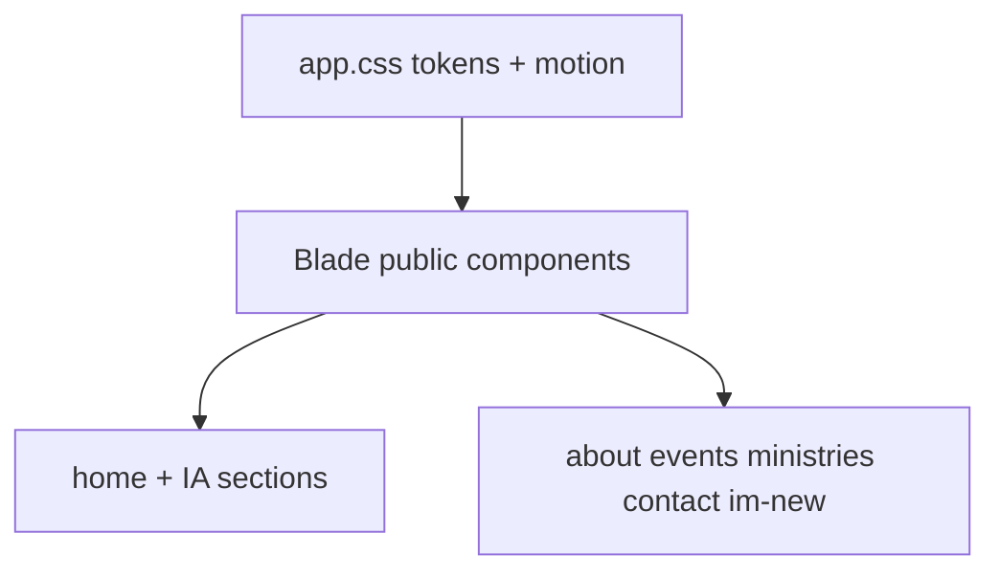

# Public Site UI Redesign (1B · toàn site)

## Direction (locked)

Evolve **Open Door Light → Open Door Alive**: vẫn gospel-centered / welcoming / Vietnamese-first, nhưng **đậm màu hơn, có chiều sâu, sống động hơn**.

- **Không** neon, purple glow, glassmorphism SaaS, terracotta-on-cream template.
- **Có** palette contrast rõ, card elevation, 2–4 motion có chủ đích, lớp trang trí CSS 2D/3D nhẹ trên hero/CTA.
- Hero vẫn **brand-first, không card**; card dùng cho list tương tác, form panel, meta panel, nội dung phân vùng.

## 1. Design tokens (`[resources/css/app.css](resources/css/app.css)`)

Cập nhật `@theme` (và mirror ngắn trong `[docs/DESIGN_SYSTEM.md](docs/DESIGN_SYSTEM.md)`):

| Role                      | Hướng mới                                                                           |
| ------------------------- | ----------------------------------------------------------------------------------- |
| Background                | Soft blue-stone `#EEF2F7` (bớt “kem phẳng”)                                         |
| Surface                   | `#FFFFFF` card rõ trên nền                                                          |
| Primary                   | Deep azure ink `#0F274F` → hover `#0A1C3A`                                          |
| Accent                    | Rich amber `#C9892E` (dùng bold hơn: eyebrow, icon wash, CTA highlight)             |
| Surface alt / Accent soft | Tint xanh/amber rõ hơn để phân chapter                                              |
| Shadows                   | Thêm `shadow-lg`; card **resting = border + shadow-sm**, hover = lift + `shadow-md` |
| Radii                     | `lg/xl` hơi lớn hơn cho card hiện đại                                               |

Thêm utility layer:

- `.ui-card` — border + surface + shadow + radius (base cho panel/card)
- `.ui-reveal` — scroll-enter (opacity + translateY)
- `.ui-float-3d` — lớp trang trí `perspective` / `transform-style: preserve-3d` / float keyframes
- Giữ `prefers-reduced-motion` (đã có)

## 2. Motion (`[resources/js/app.js](resources/js/app.js)` + CSS)

Không thêm thư viện nặng (Three.js). Chỉ:

1. **Scroll reveal** — `IntersectionObserver` gắn `.ui-reveal` (một lần).
2. **Hero** — staggered fade/slide + 2–3 blob/orb CSS 3D float phía sau chữ (pointer-events none).
3. **Card hover** — `translateY(-4px)` + shadow + border primary (≤200ms).
4. **Header** — subtle backdrop blur khi sticky (vẫn readable).

## 3. Shared components (`resources/views/components/public/*`)

Restyle toàn bộ skin (giữ API props / routes / a11y):

- `[content-card.blade.php](resources/views/components/public/content-card.blade.php)` — `.ui-card`, hover lift, optional accent meta bar
- `[button.blade.php](resources/views/components/public/button.blade.php)` — primary đậm hơn; secondary có shadow nhẹ
- `[site-header.blade.php](resources/views/components/public/site-header.blade.php)` / `[site-footer.blade.php](resources/views/components/public/site-footer.blade.php)` — elevation, inverse footer giàu hơn
- `[home-hero.blade.php](resources/views/components/public/home-hero.blade.php)` — full-bleed gradient plane + 3D orbs + brand H1
- `[cta-band.blade.php](resources/views/components/public/cta-band.blade.php)` — band có chiều sâu (gradient + soft pattern)
- `[page-header](resources/views/components/public/page-header.blade.php)`, `[section-header](resources/views/components/public/section-header.blade.php)`, `[empty-state](resources/views/components/public/empty-state.blade.php)`, `[alert](resources/views/components/public/alert.blade.php)`, `[form-field](resources/views/components/public/form-field.blade.php)`, `[list-tile](resources/views/components/public/list-tile.blade.php)`, `[status-chip](resources/views/components/public/status-chip.blade.php)`, `[contact-info](resources/views/components/public/contact-info.blade.php)` — đồng bộ border/shadow/spacing

Component mới (tái sử dụng, không one-off page CSS):

- `x-public.info-card` — panel có border/shadow cho vision/mission/visit/meta
- `x-public.reveal` — wrapper gắn class reveal (optional slot wrapper)

## 4. Home hoàn thiện IA (`[resources/views/public/home.blade.php](resources/views/public/home.blade.php)`)

Thứ tự theo `[docs/HOME_PAGE_IA.md](docs/HOME_PAGE_IA.md)`:

1. Hero (restyle)
2. **Church introduction** — vision + mission (+ history teaser → About) trong `info-card` grid
3. **Visit / Find us** — address + `contact-info` + CTA Contact (data sẵn từ `$churchInfo`)
4. Events grid
5. Ministries grid
6. CTA band

Controller `[PublicSiteController::home](app/Http/Controllers/PublicSiteController.php)` đã có `churchInfo` — **không cần field CMS mới**.

## 5. Các trang còn lại (cùng skin)

| Page                  | Thay đổi chính                                                                        |
| --------------------- | ------------------------------------------------------------------------------------- |
| About                 | Reading blocks → `info-card` sections                                                 |
| Events index/show     | Card grid + meta panel `.ui-card`                                                     |
| Ministries index/show | Card grid + list-tile trong panel                                                     |
| Contact / I’m New     | Form trong surface card có shadow; split layout rõ vùng                               |
| Coming soon           | Page header + card message                                                            |
| Layout                | `[layouts/public.blade.php](resources/views/layouts/public.blade.php)` — body nền mới |

**Không đổi** routes, validation, Filament admin, models.

## 6. Verification

- `npm run build` (Vite/Tailwind)
- Spot-check responsive + `prefers-reduced-motion`
- Feature tests public routes nếu đã có (chạy hẹp `php artisan test --compact` filter liên quan public)
- Pint chỉ nếu đụng PHP

## Out of scope

- CMS ảnh hero / gallery / sermon
- Service times field
- Filament admin theme
- WebGL / Three.js

